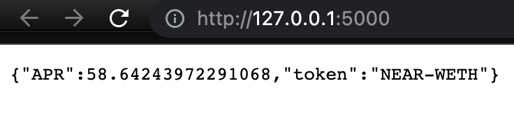
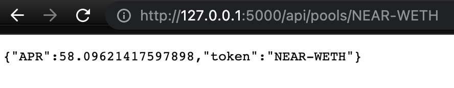
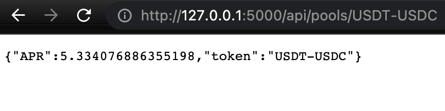

# auroraswap-stats

The app is able to fetch APR for available UNI LP.
https://127.0.0.1:5000/api/pools/NEAR-WETH

Logic is partially replicated using [THIS REPO](https://github.com/vfat-tools/vfat-tools/blob/master/src/static/js/aurora_auroraswap.js)

Async nature of the original js code is absent, that's why the app is kinda slow.

## Running locally
```
pipenv install
pipenv shell
FLASK_APP=main.py flask run 
```

## Results


